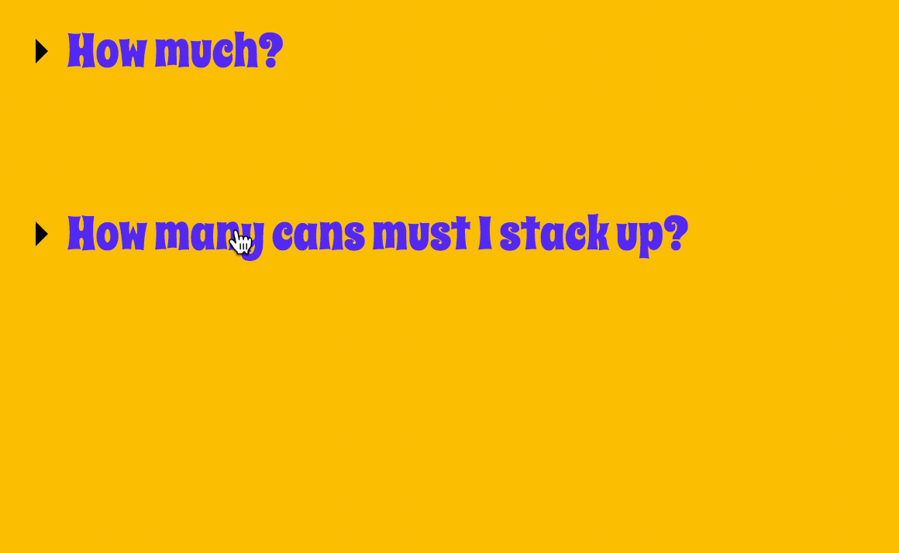

**我们需要知道：**

- Checkbox hack
- 如何用CSS绘制三角形

## Checkbox hack

`checkbox hack` 就是当我们使用连在一起的`label`标签和`checkbox input`时，我们点击`label`会使得`checkbox`被勾选，就好像我们点击了`checkbox`一样。利用这个特性，辅以CSS，我们便可以实现对一些元素的控制。像这样：

```html
<label for="toggle-1">Do Something</label>
<input type="checkbox" id="toggle-1">
<div>Control me</div>
```

## CSS绘制箭头

### 基本原理

把元素的高度和宽度设为0，然后通过截取border的部分“拐角”来实现。

### 一个梯形

试一下以下代码：

```css
<div id="demo11"></div>

<style>
#demo11 {
  border: 10px solid #000;
  border-left-color: #f00;
  width: 10px;
  height: 10px;
}
</style>
```

我们可以看到一个梯形：


### 一个三角形

当我们把元素的宽、高均设为0，且其他边设为透明，即可得到三角形。

```CSS
<div id="demo12"></div>

<style>
#demo12 {
  border: 10px solid #000;
  border-left-color: #f00;
  width: 0;
  height: 0;
}
</style>
```


*tips:*
通过调整border的宽度，我们可以得到不同角度的三角形。

## CSS实现的FAQ-Answer-Revealing效果



[在线预览](https://saifeilee.github.io/FAQ-Answer-Revealing.html)