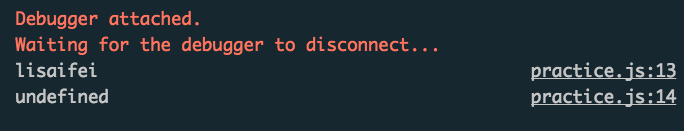
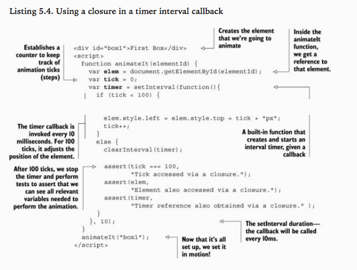
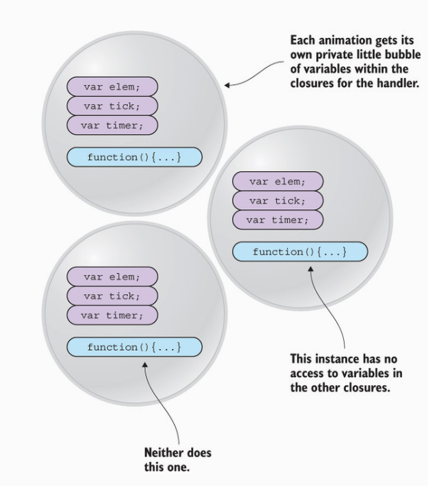

> 最近正在阅读《Secrets of the JavaScript Ninja》，真的是一本不可多得的好书。今天读到了关于JS中 Closure（闭包）的常见使用实例，记录下来与大家分享。

### 1: 实现私有变量 

很多编程语言支持私有变量--对外部隐藏的对象属性。私有变量非常有用，因为当用户从外部访问对象的时候，我们并不想暴露给用户过多不必要的执行细节。但不幸的是，JavaScript并不原生支持私有变量。但是通过closure(闭包),我们可以近似地实现私有变量。如下所示：

```javascript
function Ninja() {
  var name;       // 定义在构造器函数内部的变量，是私有的
  this.getName = function () {
    return name;
  }
  this.setName = function(str) {
    name = str;
  }
}

ninja = new Ninja();
ninja.setName('lisaifei');    // 只有通过指定的方法才能访问
console.log(ninja.getName());
console.log(ninja.name);      // 无法作为对象实例的属性直接访问
```

执行结果如下：

### 2: 与回调函数相结合

举个例子：
在一个定时器内部回调函数中使用闭包.


实现的效果为：完成一个目标元素的动画.
[在线效果展示](https://saifeilee.github.io/closure-callback.html)

这里我们需要注意到，示例代码使用一个匿名函数作为`setInterval` 的参数，实现了元素动画。这个匿名函数通过获取`elem, tick , timer` 来控制动画的进程。在这里，我们若把这三个变量放到全局作用域当中也可以实现相同的效果，这样做与使用closure的不同在于，使用全局作用域方法时，若我们的目标元素不止一个，我们需要为每一个目标设立一组控制变量。而如果使用closure的话，我们相当于为每一个变量封装好了自己的控制变量。对比来看，使用closure极大的简化了我们的代码。


