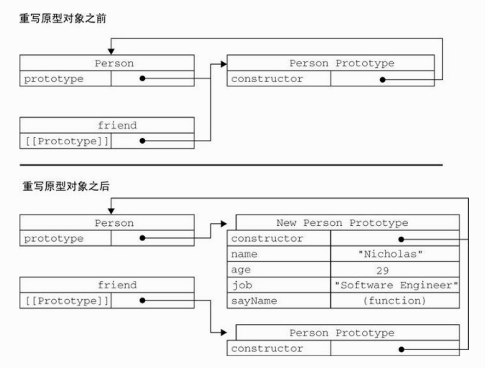

# 动态原型模式的注意事项

`使用动态原型模式时，不能用对象字面量重写原型`

```javascript
function Person() {
}

var friend = new Person();

Person.prototype = {
    constructor: Person,
    name : "Nicholas",
    age : 29,
    job : "Software Engineer",
    sayName : function () {
        alert(this.name);
    }
};

friend.sayName();   //error
```

## 原因

我们先回顾一下`new` 的实现步骤:

1. 首先新建一个对象
2. 然后将对象的原型指向 Person.prototype
3. 然后 Person.apply(obj)
4. 返回这个对象

伪代码表示：

```javascript
new Person("John") = {
    var obj = {};
    obj.__proto__ = Person.prototype; // 此时便建立了obj对象的原型链：
    // obj->Person.prototype->Object.prototype->null
    var result = Person.call(obj,"John"); // 相当于obj.Person("John")
    return typeof result === 'object' ? result : obj; // 如果无返回值或者返回一个非对象值，则将obj返回作为新对象
}
```

请记住:`实例中的指针仅指向原型,而不指向构造函数`。



从上图可以看出，重写原型对象切断了现有原型于任何之前存在的对象实例之间的联系;它们引用的自然是最初的原型。