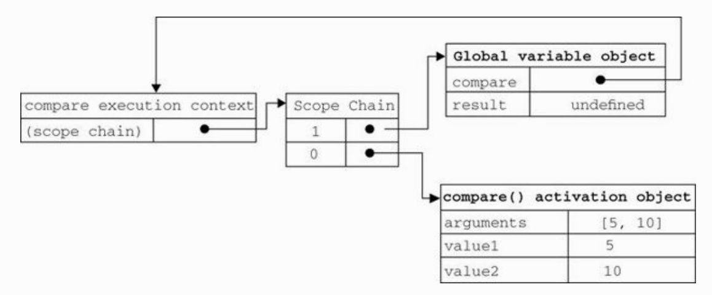

# 阅读笔记

## 递归

- `arguments.callee`是一个指向正在执行的函数的指针,可用来实现函数的递归调用，比使用函数名更保险，因为函数名作为指向原始函数的指针可能会被修改。

```javascript
function factorial(num){
    if (num <= 1){
        return 1;
    } else {
        return num * arguments.callee(num-1);
    }
}
```

但是在`strict`模式下,不能通过脚本访问`arguments.callee`,访问这个属性会导致错误.解决方法: 命名函数表达式

```javascript
var factorial = (function f(num) {
    if (num <= 1) {
        return 1;
    } else {
        return num * f(num - 1);
    }
});
```

以上代码创建了一个名为f()的命名函数表达式，然后将它赋值给变量factorial。即便把函数赋值给了另一个变量，函数的名字f仍然有效，所以递归调用照样能正确完成。这种方式在严格模式和非严格模式下都行得通。

## 执行环境和作用域

- 执行环境定义了变量或函数有权访问的其他数据,每个执行环境都有一个与之关联的`变量对象`,环境中定义的变量和函数都保存在这个对象中。虽然我们编写的代码无法访问这个对象,但解析器在处理数据时会在后台使用它。
- 执行环境分为全局执行环境和函数执行环境。
- 每次进入一个新执行环境,都会创建一个用于搜索变量和函数的作用域链.
- 变量的执行环境有助于确定应该何时释放内存。

- 当执行流进入下列任何一个语句时,作用域链会加长:
    1. try-catch语句的catch块
    2. with语句

- 使用`var`声明的变量会自动添加到最接近的环境中,若省略`var`,该变量会自动被添加到全局环境.
- 垃圾回收机制的原理：找出那些不再使用的变量,释放其占用的内存。常见的两个策略：`标记清除`和`引用计数`.
- 解除引用:当数据不再有用,建议把值设置为`null`.作用是让值脱离执行环境,以便垃圾收集器下次运行时将其回收。
- 确定一个值是那种基本类型用`typeof`操作符,确定是哪种引用类型可以用`instanceof`操作符.
- 基本数据类型:Undefined, Null, Boolean, Number, String, Symbol.

### 闭包

当某个函数第一次被调用时，会创建一个执行环境（execution context）及相应的作用域链，并把作用域链赋值给一个特殊的内部属性（即[[Scope]]）。然后，使用this、arguments和其他命名参数的值来初始化函数的活动对象（activation object）。但在作用域链中，外部函数的活动对象始终处于第二位，外部函数的外部函数的活动对象处于第三位，……直至作为作用域链终点的全局执行环境。例子:

```javascript
function compare(value1, value2) {
    if (value1 < value2) {
        return -1;
    } else if (value1 > value2) {
        return 1;
    } else {
        return 0;
    }
}
var result = compare(5, 10);
```



- 由于闭包会携带包含它的函数的作用域,因此会比其他函数占有更多的内存.
- 闭包会引用包含函数的整个活动对象。

#### 闭包与变量

> 闭包只能取得包含函数中任何变量的最后一个值。
例子：

```javascript
function createFunction() {
    var result = new Array();
    // 注意此处使用`var`
    for (var i = 0; i < 10; i++) {
        result[i] = function() {
            return i;
        };
    }
    return result;
}
let res = createFunction();
for(let i = 0; i < 10; i++) {
    console.log((res[i])());
}
// 输出: 全为10
```

表面上看,似乎每个函数都应该返回自己的索引值,即位置0的函数返回0，位置1的函数返回1，以此类推。但实际上，每个函数都返回10。因为每个函数的作用域链中都保存着createFunctions()函数的活动对象，所以它们引用的都是同一个变量i。当createFunctions()函数返回后，变量i的值是10，此时每个函数都引用着保存变量i的同一个变量对象，所以在每个函数内部i的值都是10。但是，我们可以通过创建另一个匿名函数强制让闭包的行为符合预期，如下所示。

```javascript
function createFunction() {
    var result = new Array();

    for (var i = 0; i < 10; i++) {
        result[i] = function(num) {
            return function() {
                return num;
            };
        }(i);
    }

    return result;
}
```

或者使用`let`

```javascript
function createFunction() {
    var result = new Array();
    // 注意此处使用`let`
    for (let i = 0; i < 10; i++) {
        result[i] = function() {
            return i;
        };
    }
    return result;
}
let res = createFunction();
for(let i = 0; i < 10; i++) {
    console.log((res[i])());
}
// 输出: 1, 2, 3, 4, ... , 8, 9 （索引）
```

#### 内存泄漏

- 如果闭包的作用域链中保存着一个HTML元素，那么就意味着该元素将无法被销毁。

### BOM

- 最好用`top`而非`window`来引用框架,因为top对象始终指向最高层的框架,也就是浏览器窗口。因为对于在一个框架中编写的任何代码来说，其中的window对象指向的都是那个框架的特定实例，而非最高层的框架。
- 在使用框架的情况下，浏览器中会存在多个Global对象。在每个框架中定义的全局变量会自动成为框架中window对象的属性。由于每个window对象都包含原生类型的构造函数，因此每个框架都有一套自己的构造函数，这些构造函数一一对应，但并不相等。例如，top.Object并不等于top.frames[0].Object。这个问题会影响到对跨框架传递的对象使用instanceof操作符。
- 跨浏览器取得窗口左边和上边的位置:

```javascript
var leftPos = (typeof window.screenLeft == 'number') ? window.screenLeft : window.screenX;
var topPos = (typeof window.screenTop == 'number') ? window.screenTop : screenY;
```

- 解析查询字符串:

```javascript
function getQueryStringArgs () {
    var qs = (location.search.length > 0 ? location.search.substring(1) : ""),
    args = {},
    items = qs.length ? qs.split("&") : [],
    item = null,
    name = null,
    value = null,
    len = items.length;

    for (let i = 0; i < len; i++) {
        item = items[i].split("=");
        name = decodeURIComponent(item[0]);
        value = decodeURIComponent(item[1]);

        if (name.length) {
            args[name] = value;
        }
    }
    return args;
}
```

### DOM

#### 节点层次

##### Node类型

- JS所有节点类型都继承自Node类型。
- NodeList是一种类数组对象,它是基于DOM结构`动态`执行查询的结果,其`length`属性表示的是访问NodeList的那一刻,其中包含的节点数量。
- 几个属性:parentNode, childNodes, previousSibling, nextSibling, firstChild, lastChild, `ownerDocument`
- 操作节点：appendChild(), insertBefore(), replaceChild(), removeChild(), cloneNode(), normalize()
- cloneNode()不会复制添加到DOM节点中的JavaScript属性，例如事件处理程序等。这个方法只复制特性、（在明确指定的情况下也复制）子节点,复制前建议先移除事件处理程序。

##### Document类型

- document对象表示整个HTML页面,可作为全局对象访问,子节点可能是一个DocumentType(最多1个)、Element(最多1个)、ProcessingInstruction或Comment。
- 常用属性: URL, domain, referrer
- 当页面中包含来自其他子域的框架或内嵌框架时,通过将每个页面的document.domain设置为相同的值,这些页面就可以互相访问对方包含的JS对象了.
- 查找元素: getElementById(), getElementsByTagName(), getElementByName()
- 特殊集合： document.anchors, document.forms, document.images, document.links
- 取得特性: getAttribute(), setAttribute(), removeAttribute()
- NodeList, NamedNodeMaped和HTMLCollection都是动态的,所有NodeList对象都是在访问DOM文档时实时运行的查询。应尽量减少访问NodeList的次数,因为每次访问NodeList都会运行一次基于文档的查询,所以可以考虑将NodeList中的值缓存起来。
- CDATA指的是不应被XML解析器进行解析的文本数据,只出现在XML文档中。

- 递增、递减运算符对任何值都适用,所遵循的规则：
    1. 在应用于一个包含有效数字字符的字符串时，先将其转换为数字值，再执行加减1的操作。字符串变量变成数值变量。
    2. ...不包含数字字符的字符串,将变量的值设置为NaN。字符串变量变成数值变量。
    3. 应用于对象时,先调用对象的valueOf()方法,取得一个可供操作的值,再应用上述规则,如果结果是NaN,则在调用toString()方法后再应用前述规则。对象变量变成数值变量。

- toString()和String()的区别:
    toString()不能转换null和undefined,String()可以。
- String()/new String()区别:
    String()返回string, new String()返回object.String作为普通函数时会产生一个字符串(一个原始值)。作为构造函数时会产生一个String对象的实例.后者在JavaScript中很少用到,所以基本上你可以忽略掉String作为构造函数的用法,但一定要记得它是个转换函数.著作权归作者所有。

### Object

- 通过对象字面量定义对象时,实际上不会调用Object构造函数。
- 包含数字和非字母非数字的属性名要用`[]`来访问
- 检测数组 instanceof, Array.isArray()
- 如果数组中的某一项的值是null或者undefined，那么该值在join()、toLocale-String()、toString()和valueOf()方法返回的结果中以空字符串表示.
- Array 模拟队列的方法: shift()/unshift()
- sort()会调用每个数组项的toString()转型方法,然后比较得到的字符串。

  ```javascript
    var values = [0, 1, 5, 10, 15];
    values.sort();
    console.log(values) // Output: [ 0, 1, 10, 15, 5 ]
    // 在进行字符串比较时,"10"位于"5"前面
  ```

  > sort()接受一个比较函数作为参数,比较函数接收两个参数，如果第一个参数应该位于第二个之前则返回一个负数，如果两个参数相等则返回0，如果第一个参数应该位于第二个之后则返回一个正数。

- splice()方法可用于:`删除`,`插入`,`替换`.
- indexOf()/lastIndexOf()要求查找的项必须严格相等(===),所以若目标值是一个Object,需要注意,如下例:
  ```javascript
  var person = {name: 'waltermitty'};
  var people = [{name: 'waltermitty'}];
  var morePeople = [person];
  console.log(people.indexOf(person));      // -1
  console.log(morePeople.indexOf(person));         // 0
  ```

- 迭代方法: every(),filter(),forEach(),map(),some()
- 缩小方法: reduce()/reduceRight()
  ```javascript
  // 使用reduce()方法对数组求和
  var sum = values.reduce(function (prev, cur, index, array) {
        return prev + cur;
    });
  ```

- 对一个对象数组按照某个属性排序:
```javascript
function createComparisonFunction(propertyName) {
  return function (obj1, obj2) {
    var value1 = obj1[propertyName];
    var value2 = obj2[propertyName];

    if (value1 < value2) {
      return -1;
    } else if (value1 > value2) {
      return 1;
    } else  {
      return 0;
    }
  };
}
```

- 使用call()/apply()来扩充作用域的最大好处:对象不需要与方法有任何耦合关系。
- 3个特殊的引用类型:Boolean, Number, String.每当读取一个基本类型的时候,后台自动创建一个对应的基本包装类型的对象.例子:
    ```javascript
    var s1 = "some text";
    var s2 = si.substring(2);
    ```
    后台自动处理:
    ```javascript
    var s1 = new String("some text");
    var s2 = s1.substring(2);
    s1 = null;
    ```

- 引用类型与基本包装类型的主要区别就是对象的生存期。使用new操作符创建的引用类型的实例，在执行流离开当前作用域之前都一直保存在内存中。而自动创建的基本包装类型的对象，则只存在于一行代码的执行瞬间，然后立即被销毁。这意味着我们不能在运行时为基本类型值添加属性和方法。
- 使用new调用基本包装类型的构造函数,与直接调用同名的转型函数(Number()/String()/Boolean())是不一样的。
- 布尔表达式中的所有对象都会转换为true
- javascript.prototype.trim:
  ```javascript
  String.prototype.trim = function () {
    return this.replace(/^[\s\uFEFF\xA0]+|[\s\uFEFF\xA0]+$/g, '');
  };
  // \uFEFF: Zero Width No-Break Space(零宽无间断间隔的字符)
  // \xA0: 不间断空白符
  ```

- 舍入: Math.ceil()向上舍入；Math.floor()向下舍入;Math.round()四舍五入
- 利用Math.random()从某个整数范围随机选择一个值:
  ```javascript
  值 = Math.floor(Math.random() * 可能值的总数 + 第一个可能的值)
  ```
- document.activeElement属性始终引用DOM中当前获得了焦点的元素。默认情况下，文档刚刚加载完成时，document.activeElement中保存的是document.body元素的引用。文档加载期间，document.activeElement的值为null。
- document.hasFocus()用于确定文档是否获得了焦点。
- 为innerHTML设置HTML字符串后，浏览器会将这个字符串解析为相应的DOM树。因此设置了innerHTML之后，再从中读取HTML字符串，会得到与设置时不一样的结果。原因在于返回的字符串是根据原始HTML字符串创建的DOM树经过序列化之后的结果。
- 在使用innerHTML,outerHTML属性和insertAdjacentHTML()方法时，最好先删除要被替换的元素的事件处理程序和JS对象属性。
- scrollIntoView()方法
-`文档模式(document mode)`决定了可以使用什么功能

#### DOM2和DOM3
- DOM1级主要定义的是HTML和XML文档的底层结构。
- DOM2级核心(DOM Level 2 Core)增加了更多的方法和属性;关键词：DOM2级视图、事件、样式、遍历和范围、HTML
- 遍历即使用NodeIterator或TreeWalker对DOM执行深度优先的遍历。
    例子:创建一个只显示`<p>`元素的节点迭代器:
```javascript
    var filter = {
    acceptNode: function(node) {
        return node.tagName.toLowerCase() == "p" ?
            NodeFilter.FILTER_ACCEPT : NodeFilter.FILTER_SKIP;
    }
};
```

#### 事件

- 事件流包括三个阶段:事件捕获、处于目标阶段和事件冒泡阶段。首先发生的是事件捕获，为截获事件提供了机会。然后是实际的目标接收到事件。最后一个阶段是冒泡阶段，可以在这个阶段对事件做出响应。
- 事件处理函数中有一个局部变量event,即事件对象,无须自己定义,也不用从函数的参数列表读取。
- 事件处理函数的内部使用`with`扩展作用域,从而实现能够直接访问自己的属性。
```html
<!-- 输出 "Click Me" -->
<input type="button" value="Click Me" onclick="alert(value)">
```

在HTML中指定事件处理程序的缺点:
1. 时差问题。用户在HTML元素一出现就在页面上触发事件,但可能此时并不具备事件处理的执行条件。因此,使用`try-catch`
2. 这样扩展事件处理程序的作用域链在不同的浏览器中会导致不同的结果。不同JavaScript引擎遵循的标识符解析规则略有差异，很可能会在访问非限定对象成员时出错。
3. HTML与JS代码紧密耦合。

- 事件对象
  `currentTarget`属性:其事件处理程序当前正在处理事件的那个元素; `target`属性：事件的目标；如果将事件处理程序指定给目标元素,则this,currentTarget和target包含相同的值。

```javascript
  const btn = document.getElementById('btn');
    btn.onclick = function (event) {
        console.log(event);
        alert(event.currentTarget === this); // true
        console.log(event.target === this); // true
    }
```

  如果事件处理程序存在于按钮的父节点中(例如document.body),那么这些值是不相同的
  ```javascript
    document.body.onclick = function (event) {
        alert(event.currentTarget === document.body); //true
        alert(this === document.body); //true
        alert(event.target === document.getElementById("myBtn")); //true
    };
  ```

- 只有`cancelable`属性设置为true的事件,才可以使用preventDefault()来取消其默认行为。
- 事件对象的`eventPhase`属性,可以用来确定事件当前正处于时间流的哪个阶段。1表示捕获阶段,2表示"处于目标",3表示冒泡阶段.
- 只有在事件处理程序执行期间,event对象才会存在,一旦事件处理程序执行完成,event对象就会被销毁。
- 无障碍性问题(www.webaim.org)[www.webaim.org]和(http://yaccessibilityblog.com)[http://yaccessibilityblog.com]
- 3个键盘事件:
  1. keydown: 按下任意键时触发,若按住不放,会重复触发.
  2. keypress: 按下字符键或ESC键时触发,按住不放会重复触发.Safari 3.1之前的版本也会在用户按下非字符键时触发keypress事件。
  3. keyup

#### 事件

- hashchange事件在URL参数列表(及URL中“#”号后面的所有字符串)发生变化时触发。必须要把hashchange事件处理程序添加给window对象。
- 利用`事件委托`解决事件处理程序过多问题。事件委托利用了事件冒泡,只指定一个事件事件处理程序就可以管理某一类型的所有事件。
- 最适合采用事件委托技术的事件包括：click/mousedown/mouseup/keydown/keyup/keypress
- 在浏览器卸载页面之前移除所有事件处理程序。