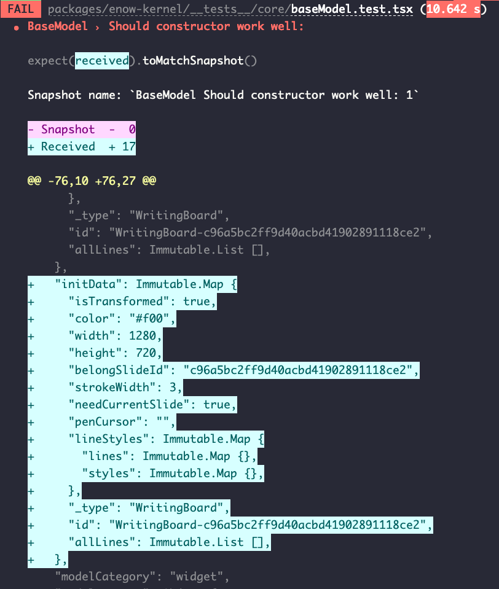

# ENOW单测思考与实践

## Tips

1. 单元测试的对象是最小可测试部件
2. 单元测试应该尽可能小，不应该依赖其他模块的输入，使用mock进行隔离
3. 瓶颈1，使用开源enzyme-inferno方案不可靠，换用inferno-test-utils + Jest的方案

## Q&A

### Q: Jest如何只运行单个测试

- A: jest -t 'test-suite-name', test-suite-name是指describe的第一个参数, 可结合test.only使用

### Q: 如何解决paper.js引入时，单元测试报错：TypeError: Cannot read property 'acorn' of undefined

- A: [jest 'this' undefined 错误](https://github.com/facebook/jest/issues/3970#issuecomment-328703877), 在ES6模块中，babel直接将全局this转换为undefined.解决方法：添加babel ignore，同时在jest.config.js中同样添加到transformIgnorePatterns。
- 解决过程：先确认是babel处理方式导致的，使用最小demo复现，对比node_modules引入和单文件引入是否一致，确认是babel配置问题后，想办法让babel忽略该文件

### Q: 如何避免测试单元内的函数调用对测试单元的影响

- A:使用`jest.spyOn()`和`mockReturnValue()`来mock函数调用的返回

### Q: 如何避免TypeError: Converting circular structure to JSON

- 使用辅助函数处理数据，将重复的字段过滤掉

```javascript
var cache = [];
JSON.stringify(o, function(key, value) {
    if (typeof value === 'object' && value !== null) {
        if (cache.indexOf(value) !== -1) {
            // Circular reference found, discard key
            return;
        }
        // Store value in our collection
        cache.push(value);
    }
    return value;
});
```

## 阶段目标

1. 把单测加入到开发流程中
2. 配置测试覆盖率
3. 给所有的函数和类添加单元测试

### 实例

1. 某一版本对baseModel做了改动，单元测试帮助快速确定影响范围:

