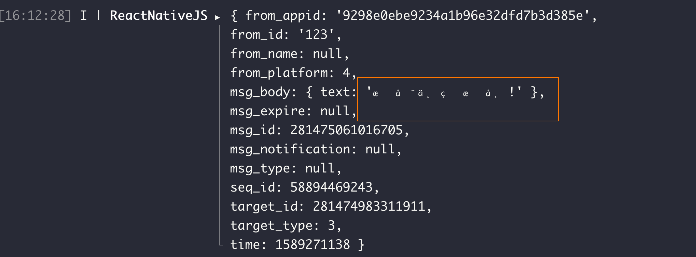
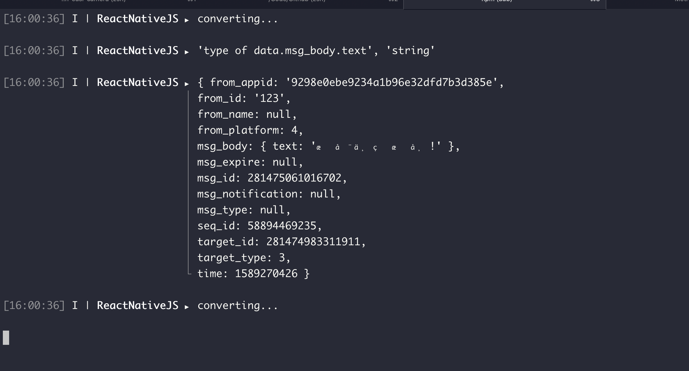

## 问题背景

IM-SDK V4.0版本，在React Native应用中，发出的信息正常，web端正常，只有app原生环境接收到的中文信息呈现乱码:


## 推测

1. sdk很多业务在用，乱码问题不是普遍存在，并且问题只在native环境的接收端存在问题，合理推测是二进制解码存在兼容问题；

## 分析定位

### 第一步-缩小范围

打印日志发现text的类型确实是`string`:

基本可确认是这一步的解码出问题了，查看text的解码逻辑。

### 第二步-推测问题成因

代码中text的解码使用了一个名叫`arraybuffer-to-string`的npm包，这个包有两个入口，分别用于兼容node环境和浏览器环境:


其中node环境直接采用`Buffer.from()`方法解码，浏览器环境采用`TextDecoder`对象，通过添加日志发现，React Native环境运行的是浏览器入口中的方法：


由于ReactNative环境中不存在`TextDecoder`对象，因此最终字符解码采用的是`String.fromCharCode`方法。进一步推测这个方法的解码有问题。

### 第三步-验证推测

#### 准备

分别模拟RN（JavascriptCore）/ Node / 浏览器环境，运行最小复现代码：

```javascript
 let s = '李赛飞';
 let code = s.charCodeAt(0);
 let decodedStr = String.fromCharCode(code);
 console.log(decodedStr);
```

结果解析正常, 说明String方法本身是没有问题

## 解决方式

统一采用`Buffer`对象进行解码，针对RN兼容，引入`buffer polyfill`

---

## 破案

```javascript
const  {Base64} = require('js-base64');

function ab2str(buf) {
  return String.fromCharCode.apply(null, new Uint16Array(buf));
}

function str2ab(str) {
  var buf = new ArrayBuffer(str.length*2); // 2 bytes for each char
  var bufView = new Uint16Array(buf);
  for (var i=0, strLen=str.length; i<strLen; i++) {
    bufView[i] = str.charCodeAt(i);
  }
  return buf;
}

const str = '李赛飞';

// 无atob ✅
const encodedWithoutAtob = str2ab(Base64.encode(str));
const decodedWithoutAtob = Base64.decode(ab2str(encoded));

console.log('decoded:', decodedWithoutAtob;

// 只有atob ❌

const encodedWithAtob = str2ab(Base64.atob(Base64.encode(str)));
const decodedWithAtob = Base64.decode(ab2str(encoded));

console.log('decoded:', decodedWithAtob);

// atob + btoa ✅
const encodedWithAtob = str2ab(Base64.atob(Base64.encode(str)));
const decodedWithAtob = Base64.decode(Base64.btoa(ab2str(encoded)));

console.log('decoded:', decodedWithAtob);


```

数据编码过程：
json -> string -> base64编码 -> atob编码（生成`Binary String`）-> 基于Binary-String 生成ArrayBuffer(**Uint8**)

乱码版本sdk的数据解码过程:

Uint8 -> string (使用String.fromCharCode, 生成**UTF-16**格式字符串) -> JSON

解码过程缺乏对binary-string的处理，尝试将乱码字段用btoa()解码成base64，再用Base64.decode()，成功解码中文字符

## 总结

String.fromCharCode()无法直接将Uint8数组中原数据为binary-string的部分解码为utf-8, 而是只能转码为binary-string, 所以RN端看到的乱码，实际上是binary-string。

> 参考资料
>
> - <https://developer.mozilla.org/zh-CN/docs/Web/JavaScript/Reference/Global_Objects/String/fromCharCode>
> - <https://www.ruanyifeng.com/blog/2014/12/unicode.html>
